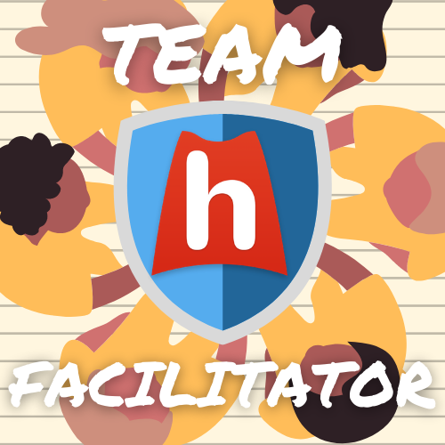

# This is a sample \(other language\)


1. Choice 1
2. Choice 2
3. Choice 3
4. Another choice



```yaml
Test: codeblock
```

> A quote


Notification


## Free Response Question

What is the date you want to start?




Company


`required date`

## Quiz Question 1

The question to display? `required`

* `date` 


## Question with correct typed response

What is todays date?

* [x] `today`
* [ ] `date` `points: 2`

```yaml
advanced: features
with: options
```

This is a quiz question? `tag` `tag: with value` `tag: with another value`

* [ ] Response wrong  `required` 
* [x] Response right`Feedback on correct answer`[Go to question 3](./#quiz-question-3) 
* [x] A response `feedback: test`

> Test quote used for comments

Word  
:  Definition of it


This is `test` [`block`](../#what-is-it-now)\`\`

l[ink test `with code` block](../#what-is-it-now)

## Quiz Question 2 \(test\) \`code\`

`test`


**Bold block at beginning** something in the middle  `inline code at end`

* [ ] Response wrong  `feedbac: eedback on wrong answer`
* [x] Response right `Feedback on correct answer` 

